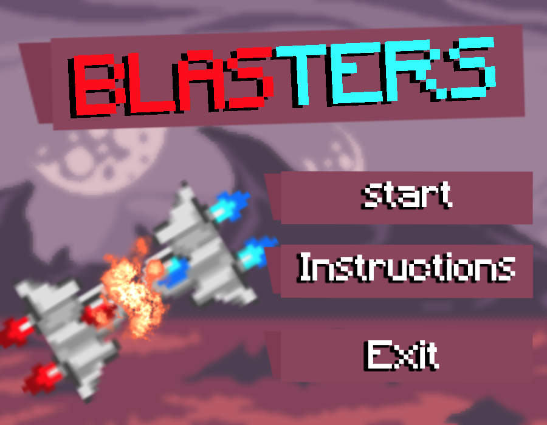

<!-- PROJECT LOGO -->

  <h3 align="center">Blasters Project</h3>

  

    Live the story of a space blaster, the hunter for precious materials found in alien planets and asteroids, but be careful... There might be other blasters around!
    This is a local 2D java PvP game. 
       
     
    
    <a href="https://github.com/Filipe4Fun1/AC-Project/raw/main/Blasters.jar"><strong>Download the Game ·</strong></a>
    <a href="https://github.com/Filipe4Fun1/AC-Project/issues">Report Bug</a>
    ·
    <a href="https://github.com/Filipe4Fun1/AC-Project/commits/main">View Change Logs</a>
  

<!-- ABOUT THE PROJECT -->
## About The Project

This game was developed in 7 nights, during a coding bootcamp.

